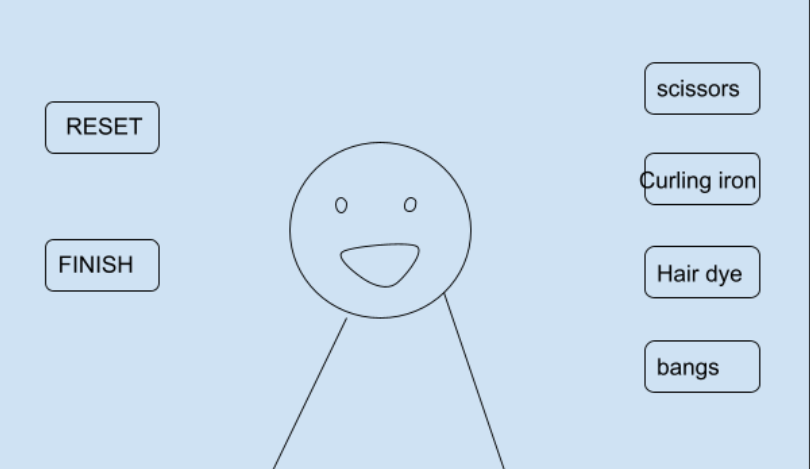

# JS Project Proposal: Hairdressing Game
## Background
  The Hairdressing game is a cartoon style game that allows players to design their hair style for my game’s main character.

  The game starts with a cartoon character shown at the center of the page. On the right side of the game page, there are several buttons that stand for different hairdressing tools such as scissors, hair dryer, and curling iron. Players can use them to change the character’s hair style. When the player finishes their design, they can submit it and the game will give a score.

## Functionality & MVPs
With the hairdressing game, the players can:
- Start the game, reset the hairstyle 
- Change the length of the hair
- Change color of the hair
- Change between curly and straight hair
- Submit the hair style they designed
- Get a score from the game

In addition, this project will include:
- An instruction about the game
- A production README
## Wireframes

On the left side:
- RESET: change the hairstyle to the initial style
- FINISH: submit the design and get a score back.

On the right side:
- Scissors: make the hair shorter
- Curling iron： make the hair curling or straight
- Hair dye: change the hair color
- Bangs: change to different bangs

## Technologies, Libraries, APIs
This project will be implemented with the following technologies:
- Canvas API to color the hair
- Iro.js color picker API to color the hair
- Webpack to transpile the JS code

## Implementation Timeline
**Weekend:** Setup project. Prepare imagines for different hair styles. Create a `character` class and start to work on the `scissors` button.

**Monday:** Finish `scissors` and `curling iron` these two features and start on the `hair dye` feature.

**Tuesday:** Finish `hair dye` and `bangs` features. Start working on `submit` `reset` and `showing score` features.

**Wednesday:** Add bgm and sound effects. Work on css

**Thursday Morning:** Deploy to GitHub pages

